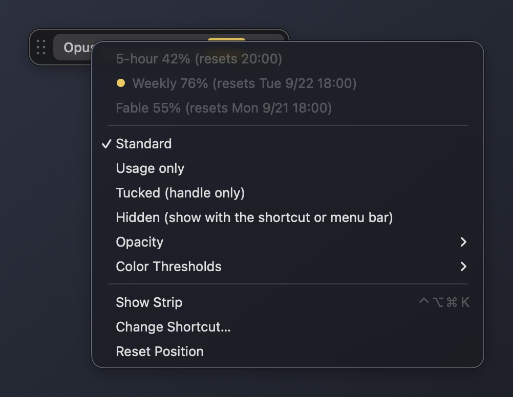
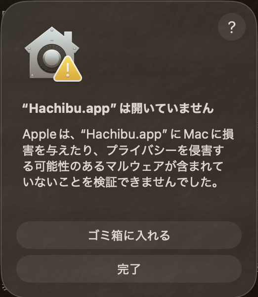
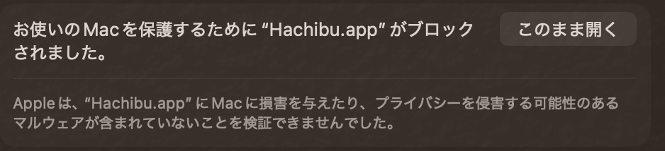
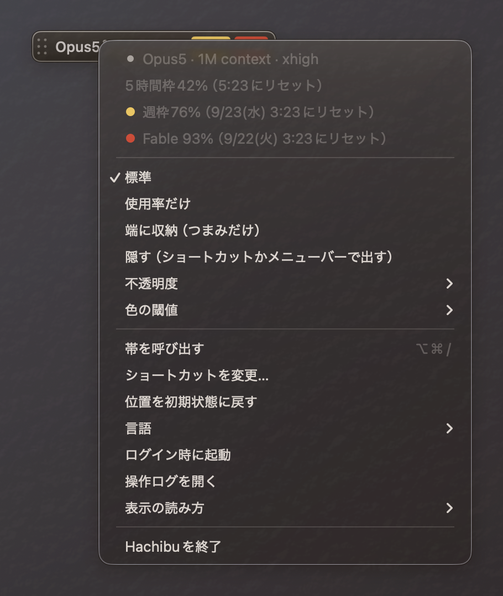

# Hachibu

I spend a worrying amount of my life checking how many tokens I have left, so I made it stay on screen. Hachibu is a small strip on top of your Mac's screen that shows Claude Code's model, effort, and usage limits. One glance is enough, and you can get back to your work.

The name comes from hara hachi bu (腹八分), the Japanese habit of eating until you are 80% full.


Hachibu is an unofficial tool made by an individual. It is not affiliated with, endorsed by, or sponsored by Anthropic, PBC.

[Download Hachibu for macOS](https://github.com/BoxPistols/hachibu/releases/latest/download/Hachibu-macos.zip) (macOS 14 or later, Apple Silicon or Intel). macOS blocks the first launch because the app is not notarized yet. You need to allow it once in System Settings > Privacy & Security; [First launch](#first-launch-allow-it-once-in-system-settings) shows each step.

> **Using 0.3.2 or earlier?** Those versions cannot tell you about updates. Download 0.4.0 once and replace `Hachibu.app` in your Applications folder; your settings stay. From 0.4.0 on, Hachibu lets you know when a new version is out. See [Updates](#updates).

[Site](https://cc-hachibu.vercel.app/) · [How it was built (Japanese)](https://zenn.dev/ait/articles/hachibu-claude-code-usage-bar) · [日本語の説明はこちら](#日本語)

## What it shows

`Opus5• xhigh · S42 W76 F93` reads as: model, effort, then usage. The small dot after the model name means a 1M context. S is the 5-hour limit, W the weekly limit, and F a per-model weekly limit (the first letter of the model's name). The menu has How to Read the Strip, which lists the same.

- A usage number turns yellow at 70% and red at 90% by default. You can change both thresholds
- Hover over the strip or open the menu bar item to see when each limit resets
- The strip never takes focus. It stays above other windows, including full-screen apps
- It keeps running whether or not a terminal is open. Turn on Launch at Login from the menu bar item or the strip's right-click menu to bring it back after a restart

## Where the numbers come from

Hachibu works on its own. No other tools are needed.

- Model and effort: the conversation Claude Code saved most recently on this Mac, and `~/.claude/settings.json`. Effort follows `/effort`: a level you change during a session is read from the conversation, and `effortLevel` in `settings.json` is used only when the conversation has none. If you set up the statusLine below, its values are used when they are newer
- Usage: you choose one of two sources

1. Usage API (optional). The first time Hachibu opens, it asks whether to use it. If you turn it on, Hachibu uses the login that Claude Code saved in your keychain to ask Anthropic's usage endpoint every 5 minutes. S, W, and F then stay up to date even when you are not using the terminal. Anthropic's [terms for Claude Code](https://code.claude.com/docs/en/legal-and-compliance) say that its OAuth login is designed to support "ordinary use of Claude Code and other native Anthropic applications", and that developers "may not collect, store, or intermediate Claude.ai credentials or session tokens". Hachibu is not an Anthropic application, so using this may be treated as a violation of those terms. Anthropic says it may enforce them without prior notice, and any measures would apply to your account. The endpoint is also not publicly documented and may stop working. The login is used only for this request and is not saved or logged
2. statusLine (official). Claude Code's statusLine passes the 5-hour and weekly usage to a command you choose. It updates only while you use Claude Code in the terminal, and it does not include per-model limits. See [statusLine setup](#statusline-setup)

You can switch the usage API on or off at any time from the menu bar item or the strip's right-click menu. Turning it off takes effect immediately: Hachibu stops reading the keychain and sending requests, and drops the values it got from the API. Hachibu does not create a login of its own, so there is nothing to revoke on Anthropic's side.

## Stays out of the way

Pick how much of the strip you want to see. Hover to expand it to Standard temporarily.


| Mode | Shows |
|---|---|
| Standard | Model, effort, and usage |
| Usage only | Usage numbers such as `S42 W76 F93` |
| Tucked | A small handle at the edge of the screen. Its ring shows the highest usage level |
| Hidden | Nothing. Show it with the shortcut or from the menu bar |


Right-click the strip to switch modes, opacity, and color thresholds. Hovering over an item previews it on the strip before you choose.



The menu bar item can show only the icon, a weekly gauge (the icon's slanted cut moves with the weekly usage, the used side turns yellow and red, and the weekly percentage sits next to it as one number), the usage numbers, or the full status. You can also summon the strip with a keyboard shortcut (⌥⌘/ by default). A second shortcut, which you set from Shortcut for Switching Display in the menu, steps through Standard, Usage only, and Tucked. When you record a new shortcut, Hachibu rejects combinations that macOS already uses. Press the new combination once more to confirm that it arrives, then click Save.

If the menu bar item does not appear, macOS is hiding it: turn Hachibu on in System Settings > Menu Bar. The strip's right-click menu shows a shortcut to that setting when this happens, and everything in the menu bar item is also in that menu.

The interface follows your macOS language: Japanese if it comes first in your preferred languages, English otherwise. You can also pick English or Japanese from Language in the menu. The action log is written in the language shown at the time.

## Install

1. Download [Hachibu-macos.zip](https://github.com/BoxPistols/hachibu/releases/latest/download/Hachibu-macos.zip). It always points to the latest release. Hachibu needs macOS 14 or later and runs on both Apple Silicon and Intel Macs
2. Unzip it (Safari may already have done this) and move `Hachibu.app` to your Applications folder
3. Open Hachibu. The first time, macOS stops it. Follow the next section once

Hachibu was called Slashstrip up to v0.2.0. If you installed Slashstrip, turn off its Launch at Login, quit it, and move it to the Trash first. Its settings are not carried over.

### First launch: allow it once in System Settings

You need to do this once for each download. Hachibu is not from the App Store and is not yet notarized by Apple ([#3](https://github.com/BoxPistols/hachibu/issues/3)), so macOS does not open it until you allow it yourself. These steps follow Apple's [Open a Mac app from an unknown developer](https://support.apple.com/guide/mac-help/open-a-mac-app-from-an-unknown-developer-mh40616/mac). The screenshots show macOS in Japanese; the layout is the same in English.

1. Open Hachibu. macOS shows "“Hachibu.app” Not Opened". Click Done. Do not click Move to Trash

   

2. Choose Apple menu > System Settings, then click Privacy & Security in the sidebar
3. Scroll down to Security. It says "“Hachibu.app” was blocked to protect your Mac." Click Open Anyway next to it. The button stays for about an hour after step 1. If it is not there, do step 1 again

   

4. Enter your login password (or use Touch ID), then click OK
5. If Hachibu does not open by itself, open it again. On its first run it asks whether to use the usage API (see [Where the numbers come from](#where-the-numbers-come-from))

From then on Hachibu opens normally, including at login. When you download a new version, you need to do this again.

If you prefer Terminal, you can remove the "downloaded from the internet" flag that macOS put on this copy, then open it:

```sh
xattr -dr com.apple.quarantine /Applications/Hachibu.app
open /Applications/Hachibu.app
```

This skips the check only for this copy. Do either of these only if you trust where the file came from.

### Before you allow it

Allowing an app that Apple has not checked is a decision you make. Some ways to check this one first:

- The source is all in this repository. You can [build it yourself](#build-from-source), and macOS does not block an app you built on your own Mac
- Compare the checksum with the SHA-256 on the [release page](https://github.com/BoxPistols/hachibu/releases/latest): `shasum -a 256 ~/Downloads/Hachibu-macos.zip`
- Read [Data](#data) for what the app reads and sends

### Permissions it may ask for

- Notifications. When Hachibu finds a new version for the first time, macOS asks whether to allow its notifications. If you do not allow them, the new version still shows at the top of the menu
- Keychain. If you turn on the usage API, macOS may ask whether to allow access to the "Claude Code-credentials" item
- Login Items. When you turn on Launch at Login, macOS tells you that Hachibu will open at login. You can manage it in System Settings > General > Login Items (Login Items & Extensions on newer versions of macOS)

After you update to a new version, macOS may ask again, because the app is not signed with a fixed Developer ID yet.

### Updates

Hachibu checks GitHub for a new version once a day. When it finds one, it sends one notification for that version and shows Hachibu x.y.z is available at the top of the menu bar item and the strip's right-click menu. Click either to open the download page.

To update, download the new `Hachibu-macos.zip`, quit Hachibu, and replace `Hachibu.app` in your Applications folder. Your settings stay. You need to allow the first launch in System Settings again, as described above.

Updates in the menu shows the version you are running, lets you turn off Check for Updates Automatically, and has Check Now. Release notes for every version are on the [releases page](https://github.com/BoxPistols/hachibu/releases).

### Uninstall

1. If you turned on Launch at Login, turn it off from the menu bar item first
2. Quit Hachibu from the menu bar item, and move `Hachibu.app` to the Trash
3. To remove its settings and logs as well:

```sh
defaults delete io.github.boxpistols.hachibu
rm -rf ~/Library/Logs/Hachibu ~/"Library/Application Support/Hachibu"
```

4. If you set up `statusline.sh`, remove it from the statusLine in `~/.claude/settings.json`

## statusLine setup

This is optional. Use it if you leave the usage API off, or if you want the model and effort of the session you are working in.

`statusline.sh` saves the JSON that Claude Code passes to the statusLine to `~/Library/Application Support/Hachibu/statusline.json`, which Hachibu reads. Download it from the release (or use `scripts/statusline.sh` in a clone) and make it executable:

```sh
curl -L -o ~/.claude/hachibu-statusline.sh https://github.com/BoxPistols/hachibu/releases/latest/download/statusline.sh
chmod +x ~/.claude/hachibu-statusline.sh
```

Then call it from the statusLine in `~/.claude/settings.json`:

```json
{
  "statusLine": { "type": "command", "command": "~/.claude/hachibu-statusline.sh" }
}
```

If you already use a statusLine command, pass it as an argument. It receives the same JSON, and its output becomes your status line.

```json
{
  "statusLine": { "type": "command", "command": "~/.claude/hachibu-statusline.sh ~/.claude/my-statusline.sh" }
}
```

Usage limits (`rate_limits`) appear in the statusLine data on Pro and Max plans, after the first response in a session.

## Using only the Claude Code desktop app

- With the usage API turned on, usage keeps updating whether you use the terminal or the desktop app
- With the usage API off, usage comes only from the terminal's statusLine, so it stops updating while you use only the desktop app. The strip keeps showing the last known values, dims them after 30 minutes, and tells you when they were last updated. See [#6](https://github.com/BoxPistols/hachibu/issues/6)

## Data

- Hachibu reads local files: Claude Code's saved conversations (only to find the most recently used model and effort), `~/.claude/settings.json`, and the statusLine file above
- It connects to the network for two things: the usage API, only if you turn it on (`api.anthropic.com`), and the update check once a day (`api.github.com`, which you can turn off from Updates in the menu). The update check sends only the app's name and version as the User-Agent
- It reads the Claude Code login from the keychain only for that request, and does not save or log it
- Settings changes and failed usage requests are logged to `~/Library/Logs/Hachibu/actions.log`

## Build from source

You need macOS 14 or later and the Xcode Command Line Tools (the full Xcode app is not needed).

The landing page at <https://cc-hachibu.vercel.app/> lives in `site/`; see [site/README.md](site/README.md).

```sh
scripts/build-app.sh            # builds build/Hachibu.app
scripts/build-app.sh --install  # copies it to ~/Applications and launches it
scripts/build-app.sh --zip      # also writes build/Hachibu-macos.zip and its SHA-256
scripts/test.sh                 # runs the tests
```

### Releasing

CI runs the tests and builds the app on macOS for every push. To release, set `VERSION` in `scripts/build-app.sh`, write the notes in `docs/releases/v<version>.md`, merge to `main`, and run the Release workflow from the Actions tab. It tests, builds `Hachibu-macos.zip` for both CPUs, and creates the tag and the release with `statusline.sh` and the SHA-256. Add the version to `NEWS` in `site/lib/content.ts` so the landing page lists it.

## Contributing

Issues and pull requests are welcome. Please run `scripts/test.sh` before sending a pull request. UI text lives in `Sources/HachibuCore/Strings.swift`; when you change it, update both English and Japanese.

## Trademarks

Claude and Claude Code are trademarks of Anthropic, PBC. Touch Bar is a trademark of Apple Inc., registered in the U.S. and other countries and regions.

## License

MIT

---

## 日本語

人生の多くの時間を、トークンの残量確認に使っています。なので画面に出しっぱなしにしました。Hachibuは、Macの画面の最前面に小さなバーを常駐させ、Claude Codeのモデル、effort、使用率を出すアプリです。ひと目で済むので、すぐ手元の作業に戻れます。

名前は「腹八分」から取りました。

> **0.3.2以前をお使いの方へ**: これらの版には新しい版を知らせる仕組みがありません。一度だけ0.4.0をダウンロードし、アプリケーションフォルダの`Hachibu.app`と入れ替えてください。設定はそのまま残ります。0.4.0からは、新しい版が出るとアプリが知らせます。手順は[アップデート](#アップデート)にあります。

Hachibuは個人が作った非公式のツールで、Anthropic, PBCとは関係がなく、同社の承認や支援も受けていません。


[サイト](https://cc-hachibu.vercel.app/)。[作った過程の記事](https://zenn.dev/ait/articles/hachibu-claude-code-usage-bar)。[macOS版をダウンロード](https://github.com/BoxPistols/hachibu/releases/latest/download/Hachibu-macos.zip)（macOS 14以降、Apple SiliconとIntelの両方）。まだAppleの公証を受けていないため、初回の起動はmacOSに止められます。「システム設定」＞「プライバシーとセキュリティ」で一度だけ許可してください。手順は[インストール](#インストール)にあります。

### 表示の読み方

`Opus5• xhigh · S42 W76 F93`は、モデル、effort、使用率の順です。モデル名の後ろの小さな点は、1Mコンテキストを表します。Sは5時間枠、Wは週枠、Fはモデル別の週枠（モデル名の頭文字）です。同じ内容は、メニューの「表示の読み方」にもあります。

- 使用率が既定で70%以上なら黄、90%以上なら赤の札で数字を囲みます。閾値はどちらも変えられます
- バーにマウスを乗せるか、メニューバーの項目を開くと、各枠がいつリセットされるかが分かります
- バーを押してもHachibuは前面に出ません。フルスクリーンのアプリを含め、ほかの窓の上に出ます
- ターミナルを開いているかどうかに関係なく動き続けます。メニューバーの項目かバーの右クリックメニューで「ログイン時に起動」を有効にすると、Macを再起動しても戻ります

### 値の出どころ

Hachibuだけで動きます。ほかの道具は要りません。

- モデルとeffort: このMacでClaude Codeが最後に保存した会話と、`~/.claude/settings.json`から読みます。effortは`/effort`に追従します。セッション中に変えた値は会話から読み、会話に無いときだけ`settings.json`の`effortLevel`を使います。下のstatusLineを設定していれば、そちらが新しいときはそちらを使います
- 使用率: 次の2つから選べます

1. 使用率API（任意）。初めて起動したときに、使うかどうかを尋ねます。有効にすると、Claude Codeがキーチェーンに保存したログイン情報を使い、5分ごとにAnthropicの使用率のエンドポイントへ問い合わせます。S、W、Fが、ターミナルを使っていないときも更新されます。[Claude Codeの規約](https://code.claude.com/docs/en/legal-and-compliance)は、OAuthによるログインを「ordinary use of Claude Code and other native Anthropic applications」（Claude Codeと、Anthropic純正のアプリの通常の利用）のためのものとし、開発者は「may not collect, store, or intermediate Claude.ai credentials or session tokens」（Claude.aiのログイン情報やセッショントークンを収集、保存、仲介してはならない）としています。HachibuはAnthropicのアプリではないため、この機能を使うと規約違反と判断されるおそれがあります。Anthropicは予告なく制限を執行しうるとしており、その措置はあなたのアカウントに及びます。エンドポイント自体も公開されておらず、使えなくなることがあります。ログイン情報はこの問い合わせにだけ使い、保存も記録もしません
2. statusLine（公式）。Claude CodeのstatusLineが、5時間枠と週枠の使用率を指定したコマンドに渡します。更新されるのはターミナルでClaude Codeを使っている間だけで、モデル別の枠は含まれません。[statusLineの設定](#statuslineの設定)を参照してください

使用率APIは、メニューバーの項目かバーの右クリックメニューから、いつでも有効・無効を切り替えられます。無効にするとすぐに、キーチェーンの読み取りと問い合わせをやめ、APIから得た値も捨てます。Hachibuは独自のログインを作らないので、Anthropic側で取り消すものはありません。

### 表示を控えめにする

表示モードは4つです。マウスを乗せると一時的に標準へ広がります。


| モード | 出るもの |
|---|---|
| 標準 | モデル、effort、使用率 |
| 使用率だけ | `S42 W76 F93`のような使用率だけ |
| 端に収納 | 画面の端の小さなつまみだけ。輪の色で、いちばん高い使用率の段階を示す |
| 隠す | 何も出さない。ショートカットかメニューバーから出す |

バーを右クリックすると、表示モード、不透明度、色の閾値を切り替えられます。項目にマウスを乗せると、選ぶ前にバーへ仮に反映します。



メニューバーの項目は、アイコンのみ、週枠のメーター（アイコンの斜めの切れ目が週枠の使用率に合わせて動き、使った側に黄や赤の色が付き、週枠の使用率を数字1つで添える）、使用率、状態の全文から選べます。ショートカット（既定は⌥⌘/）でバーを呼び出すこともできます。メニューの「表示切り替えのショートカット…」で2つ目のショートカットを設定すると、標準、使用率だけ、端に収納を順に切り替えられます。ショートカットを登録するときは、macOSが使っている組み合わせを弾きます。新しい組み合わせをもう一度押して届くことを確かめてから、「保存」を押します。

メニューバーに項目が出ないときは、macOSが隠しています。「システム設定」＞「メニューバー」でHachibuをオンにしてください。このときバーの右クリックメニューに、その設定を開く項目が出ます。メニューバーの項目でできることは、すべてバーの右クリックメニューからもできます。

画面の文言は、macOSの言語設定に合わせて日本語か英語になります。メニューの「言語」から英語か日本語を選ぶこともできます。操作ログは、書いた時点の画面の言語で残ります。

### インストール

1. [Hachibu-macos.zip](https://github.com/BoxPistols/hachibu/releases/latest/download/Hachibu-macos.zip)をダウンロードします。このリンクは常に最新のリリースを指します。macOS 14以降が必要です。Apple SiliconとIntelのどちらのMacでも動きます
2. 展開して（Safariでは自動で展開されることがあります）、`Hachibu.app`をアプリケーションフォルダへ移します
3. Hachibuを開きます。初回はmacOSに止められるので、次の手順を一度だけ行ってください

v0.2.0まではSlashstripという名前でした。Slashstripを入れていた場合は、先に「ログイン時に起動」を無効にしてから終了し、ゴミ箱に入れてください。設定は引き継がれません。

#### 初回の起動：システム設定で一度だけ許可する

ダウンロードするたびに一度だけ必要な手順です。HachibuはApp Storeで配布しておらず、Appleの公証もまだ受けていないため（[#3](https://github.com/BoxPistols/hachibu/issues/3)）、利用者が自分で許可するまでmacOSは開きません。手順はAppleの[開発元が不明なMacアプリを開く](https://support.apple.com/ja-jp/guide/mac-help/mh40616/mac)に沿っています。

1. Hachibuを開きます。「“Hachibu.app”は開いていません」と出るので、「完了」をクリックします。「ゴミ箱に入れる」は押さないでください

   

2. アップルメニュー＞「システム設定」を選び、サイドバーで「プライバシーとセキュリティ」をクリックします
3. 下へスクロールして「セキュリティ」の欄を見ると、「お使いのMacを保護するために“Hachibu.app”がブロックされました。」と出ています。その横の「このまま開く」をクリックします。このボタンは手順1から約1時間だけ出ます。見当たらなければ手順1からやり直してください

   

4. ログインパスワードを入力するか、Touch IDを使い、「OK」をクリックします
5. 自動で開かなかった場合は、もう一度Hachibuを開きます。初回は、使用率APIを使うかを尋ねます（[値の出どころ](#値の出どころ)）

これ以降は、ログイン時の起動も含めて普通に開きます。新しい版をダウンロードしたときは、もう一度この手順が要ります。

ターミナルを使う場合は、macOSがこのコピーに付けた「インターネットからダウンロードした」印を外してから開く方法もあります。

```sh
xattr -dr com.apple.quarantine /Applications/Hachibu.app
open /Applications/Hachibu.app
```

これは、このコピーに限って確認を省きます。どちらの方法も、入手元を信頼できる場合にだけ行ってください。

#### 許可する前に

Appleが確認していないアプリを開くかどうかは、使う人の判断です。先に確かめる方法があります。

- ソースはすべてこのリポジトリにあります。[自分でビルド](#ソースからビルド)したアプリは、そのMacでは止められません
- [リリースのページ](https://github.com/BoxPistols/hachibu/releases/latest)にあるSHA-256と照合できます: `shasum -a 256 ~/Downloads/Hachibu-macos.zip`
- アプリが何を読み、何を送るかは[データの扱い](#データの扱い)にあります

#### 求められることがある権限

- 通知。新しい版を初めて見つけたときに、通知を許可するかをmacOSが尋ねます。許可しなくても、新しい版はメニューの先頭に出ます
- キーチェーン。使用率APIを有効にすると、「Claude Code-credentials」の項目へのアクセスを許可するかをmacOSが尋ねることがあります
- ログイン項目。「ログイン時に起動」を有効にすると、ログイン時に開く旨をmacOSが知らせます。「システム設定」＞「一般」＞「ログイン項目」（新しいmacOSでは「ログイン項目と機能拡張」）で管理できます

まだ決まったDeveloper IDで署名していないため、新しい版に更新すると、もう一度尋ねられることがあります。

#### アップデート

Hachibuは1日に1回、GitHubで新しい版を確認します。見つけたら、その版につき1回だけ通知し、メニューバーの項目とバーの右クリックメニューの先頭に「Hachibu x.y.zが出ています」と出します。どちらを押してもダウンロードのページが開きます。

更新するには、新しい`Hachibu-macos.zip`をダウンロードし、Hachibuを終了してから、アプリケーションフォルダの`Hachibu.app`と入れ替えます。設定はそのまま残ります。初回の起動の許可は、上の手順でもう一度必要です。

メニューの「アップデート」には、動いている版、「新しい版を自動で確認」の切り替え、「今すぐ確認」があります。各版の変更点は[リリースのページ](https://github.com/BoxPistols/hachibu/releases)にあります。

#### アンインストール

1. 「ログイン時に起動」を有効にしていた場合は、先にメニューバーの項目から無効にします
2. メニューバーの項目からHachibuを終了し、`Hachibu.app`をゴミ箱に入れます
3. 設定とログも消す場合は、次を実行します

```sh
defaults delete io.github.boxpistols.hachibu
rm -rf ~/Library/Logs/Hachibu ~/"Library/Application Support/Hachibu"
```

4. `statusline.sh`を設定していた場合は、`~/.claude/settings.json`のstatusLineから外します

### statusLineの設定

任意です。使用率APIを使わない場合や、作業中のセッションのモデルとeffortを出したい場合に設定します。

`statusline.sh`は、Claude CodeがstatusLineに渡すJSONを`~/Library/Application Support/Hachibu/statusline.json`に保存し、Hachibuはそれを読みます。リリースから入手して（クローンした場合は`scripts/statusline.sh`）、実行できるようにします。

```sh
curl -L -o ~/.claude/hachibu-statusline.sh https://github.com/BoxPistols/hachibu/releases/latest/download/statusline.sh
chmod +x ~/.claude/hachibu-statusline.sh
```

そのうえで、`~/.claude/settings.json`のstatusLineから呼びます。すでに別のstatusLineを使っている場合は、そのコマンドを引数に渡してください。同じJSONがそのコマンドにも渡り、ステータス行の表示はそのコマンドの出力になります。設定の例は英語の節にあります。

使用率（rate_limits）がstatusLineに入るのはPro/Maxのプランで、そのセッションの最初の応答の後からです。

### デスクトップアプリだけで使う場合

- 使用率APIを有効にしていれば、ターミナルとデスクトップアプリのどちらを使っていても使用率は更新されます
- 使用率APIを使わない場合、使用率はターミナルのstatusLineからしか届かないため、デスクトップアプリだけを使っている間は更新されません。バーは最後に分かっている値を出し続け、30分を過ぎると薄く表示して、何時点の値かを添えます。[#6](https://github.com/BoxPistols/hachibu/issues/6)を参照してください

### データの扱い

- 読むのはローカルのファイルです。Claude Codeが保存した会話（最後に使われたモデルとeffortを知るためだけ）、`~/.claude/settings.json`、上のstatusLineのファイル
- ネットワークに接続するのは2つだけです。使用率APIを有効にした場合の`api.anthropic.com`と、1日に1回の新しい版の確認の`api.github.com`です（確認はメニューの「アップデート」で止められます）。新しい版の確認で送るのは、User-Agentのアプリ名と版だけです
- キーチェーンのログイン情報は、その問い合わせのときだけ読み、保存も記録もしません
- 設定の変更と、使用率の取得に失敗したことは`~/Library/Logs/Hachibu/actions.log`に残ります

### ソースからビルド

macOS 14以降と、Xcode Command Line Tools（Xcode本体は不要です）が必要です。

<https://cc-hachibu.vercel.app/>の紹介ページは`site/`にあります。[site/README.md](site/README.md)を参照してください。

```sh
scripts/build-app.sh            # build/Hachibu.appを作る
scripts/build-app.sh --install  # ~/Applicationsに置いて起動する
scripts/build-app.sh --zip      # build/Hachibu-macos.zipとSHA-256も作る
scripts/test.sh                 # テスト
```

#### リリースの手順

pushのたびに、CIがmacOSでテストとアプリの組み立てを行います。リリースするときは、`scripts/build-app.sh`の`VERSION`を上げ、`docs/releases/v<版>.md`に変更点を書いて`main`に入れ、ActionsタブからReleaseのワークフローを実行します。テスト、両方のCPU向けの`Hachibu-macos.zip`の組み立て、タグとリリースの作成（`statusline.sh`とSHA-256を添える）までを行います。紹介ページに載せるため、`site/lib/content.ts`の`NEWS`にも版を足してください。

### 開発への参加

issueとプルリクエストを歓迎します。プルリクエストを送る前に`scripts/test.sh`を実行してください。画面の文言は`Sources/HachibuCore/Strings.swift`にあります。変えるときは英語と日本語の両方を直してください。

### 商標

Claude、Claude CodeはAnthropic, PBCの商標です。Touch Barは、米国およびその他の国や地域で登録されたApple Inc.の商標です。

### ライセンス

MIT
