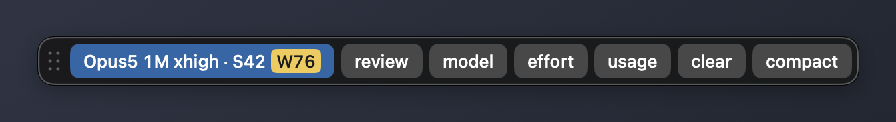
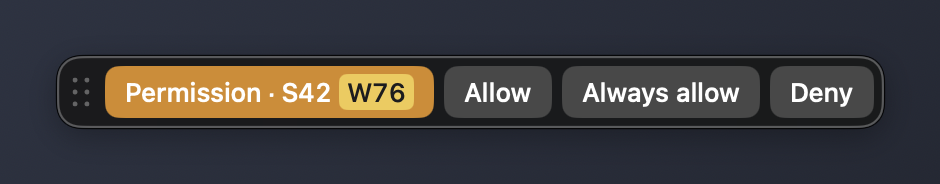
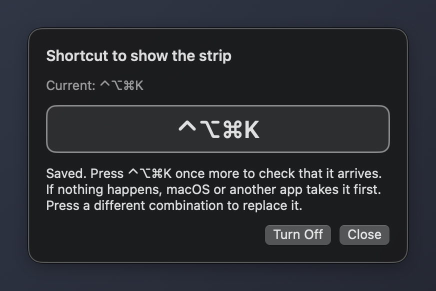

# Slashstrip

A small floating strip for Macs without a Touch Bar. It shows Claude Code's model, effort, and usage limits at a glance, and puts slash commands one click away.


Slashstrip is an unofficial tool made by an individual. It is not affiliated with, endorsed by, or sponsored by Anthropic, PBC.

[日本語の説明はこちら](#日本語)

## What it does



- Shows the model, effort, and usage (5-hour and weekly limits), for example `Opus5 1M xhigh · S42 W76`
- Marks a usage number yellow at 70% and red at 90% by default. You can change both thresholds
- Sends `/review`, `/model`, `/usage`, and other commands to the Claude Code session in the front iTerm2 tab with one click
- Shows answer buttons while Claude Code waits for a permission or asks a multiple-choice question
- Lists running sessions in start order when you click the status. Pick one to jump to its tab
- Never takes focus. Your terminal stays in front while you click the strip



## Stays out of the way

Pick how much of the strip you want to see. Hover to expand it temporarily.

| Mode | Shows |
|---|---|
| Full | Status and every button |
| Compact | Status only, plus answer buttons when needed |
| Usage only | Usage numbers such as `S93 W76`, plus answer buttons when needed |
| Tucked | A small handle at the edge of the screen. Its color shows the state |
| Hidden | Nothing, until Claude Code needs an answer |


Right-click the strip to switch modes, opacity, and color thresholds. Hovering over an item previews it on the strip before you choose.


You can also show usage in the menu bar, and summon the strip with a keyboard shortcut (⌥⌘/ by default). When you record a new shortcut, Slashstrip rejects combinations that macOS already uses, then asks you to press it once more to confirm it actually arrives.



The interface follows your macOS language: Japanese if it comes first in your preferred languages, English otherwise.

## Current status

Slashstrip reads state from one of two sources.

- With the author's Touch Bar bridge scripts in `~/.claude/btt`, everything above works. The scripts write each session's state from Claude Code hooks, decide which buttons to show, and send input to iTerm2. They are not published yet
- Without them, Slashstrip shows the model, effort, and usage from Claude Code's statusLine. Command buttons, answer buttons, and the session list are not available in this mode yet

Building the hooks bridge into the app itself is tracked in [#1](https://github.com/BoxPistols/slashstrip/issues/1). Per-model weekly limits are not part of the statusLine data, so they appear only when the bridge scripts provide them.

## Requirements

- macOS 14 or later
- Xcode Command Line Tools (the full Xcode app is not needed)
- iTerm2, for sending commands

## Build and run

```sh
scripts/build-app.sh            # builds build/Slashstrip.app
scripts/build-app.sh --install  # copies it to ~/Applications and launches it
scripts/test.sh                 # runs the tests
```

Without a signing certificate the app is ad-hoc signed, so macOS asks again for permission to control iTerm2 after each rebuild.

## statusLine setup (without the bridge scripts)

Call `scripts/statusline.sh` from the statusLine in `~/.claude/settings.json`. It saves the JSON it receives to `~/Library/Application Support/Slashstrip/statusline.json`, which Slashstrip reads.

```json
{
  "statusLine": { "type": "command", "command": "/path/to/slashstrip/scripts/statusline.sh" }
}
```

If you already use a statusLine command, pass it as an argument. It receives the same JSON, and its output becomes your status line.

```json
{
  "statusLine": { "type": "command", "command": "/path/to/slashstrip/scripts/statusline.sh ~/.claude/my-statusline.sh" }
}
```

Usage limits (`rate_limits`) appear in the statusLine data on Pro and Max plans, after the first response in a session.

## Data and permissions

- Slashstrip does not connect to the network. It only reads local files written by hooks or the statusLine
- It does not read Claude Code credentials (Keychain tokens)
- Each button press and its result are logged to `~/Library/Logs/Slashstrip/actions.log`
- Commands are typed into the front iTerm2 session through AppleScript. macOS asks for permission the first time

## Trademarks

Claude and Claude Code are trademarks of Anthropic, PBC. Touch Bar is a trademark of Apple Inc., registered in the U.S. and other countries and regions.

## License

MIT

---

## 日本語

Touch Barを搭載していないMacで、Claude Codeのモデル、effort、使用率を画面上の細い帯に常時表示し、スラッシュコマンドをワンクリックで送れるようにするアプリです。

Slashstripは個人が作った非公式のツールで、Anthropic, PBCとは関係がなく、同社の承認や支援も受けていません。


### できること

- モデル、effort、使用率（5時間枠、週枠）を出します。例: `Opus5 1M xhigh · S42 W76`
- 使用率が既定で70%以上なら黄、90%以上なら赤の札で数字を囲みます。閾値はどちらも変えられます
- `/review`、`/model`、`/usage`などのボタンを押すと、前面のiTerm2のタブで動いているClaude Codeのセッションに入力します
- 許可プロンプトや、選択肢のある質問が出ているときは、答えのボタンを出します
- 状態のボタンを押すと、動いているセッションの一覧を開始順の番号付きで出します。選んだセッションのタブへ移ります
- 帯を押してもSlashstripは前面に出ません。ターミナルを前面にしたまま操作できます

### 表示を控えめにする

表示モードは5つです。マウスを乗せると一時的にフルへ広がります。

| モード | 出るもの |
|---|---|
| フル | 状態とすべてのボタン |
| コンパクト | 状態の枠だけ。答えが要るときは応答ボタンも出す |
| 使用率だけ | `S93 W76`のような使用率だけ。答えが要るときは応答ボタンも出す |
| 端に収納 | 画面の端の小さなつまみだけ。状態は色で示す |
| 隠す | 何も出さない。Claude Codeが答えを待っているときだけ出す |

帯を右クリックすると、表示モード、不透明度、色の閾値を切り替えられます。項目にマウスを乗せると、選ぶ前に帯へ仮に反映します。


メニューバーに使用率を出したり、ショートカット（既定は⌥⌘/）で帯を呼び出したりもできます。ショートカットを登録するときは、macOSが使っている組み合わせを弾き、登録後にもう一度押してもらって、実際に届くことを確かめます。

画面の文言は、macOSの言語設定に合わせて日本語か英語になります。

### 現時点の前提

Slashstripは、次のどちらかから状態を読みます。

- `~/.claude/btt`に作者のTouch Bar連携スクリプトがある環境では、上のすべてが動きます。このスクリプトは、Claude Codeのhooksから各セッションの状態を書き出し、帯に出すボタンを決め、iTerm2へ入力を送ります。まだ公開していません
- スクリプトが無い環境では、Claude CodeのstatusLineからモデル、effort、使用率を出します。コマンドのボタン、応答のボタン、セッションの一覧は、このモードではまだ使えません

hooksとの連携をアプリに組み込む作業は[#1](https://github.com/BoxPistols/slashstrip/issues/1)で進めます。モデル別の週枠はstatusLineに含まれないため、スクリプトが別に取得している環境でだけ表示されます。

### 必要なもの

- macOS 14以降
- Xcode Command Line Tools（Xcode本体は不要です）
- iTerm2（コマンドを送る場合）

### ビルドと起動

```sh
scripts/build-app.sh            # build/Slashstrip.appを作る
scripts/build-app.sh --install  # ~/Applicationsに置いて起動する
scripts/test.sh                 # テスト
```

署名用の証明書が無い環境ではアドホック署名になるため、ビルドし直すたびに、macOSがiTerm2の操作を許可するかを尋ねます。

### statusLineの設定（スクリプトが無い環境）

`~/.claude/settings.json`のstatusLineから`scripts/statusline.sh`を呼びます。受け取ったJSONを`~/Library/Application Support/Slashstrip/statusline.json`に保存し、Slashstripはそれを読みます。すでに別のstatusLineを使っている場合は、そのコマンドを引数に渡してください。同じJSONがそのコマンドにも渡り、ステータス行の表示はそのコマンドの出力になります。設定の例は英語の節にあります。

使用率（rate_limits）がstatusLineに入るのはPro/Maxのプランで、そのセッションの最初の応答の後からです。

### データの扱いと権限

- Slashstripはネットワークに接続しません。読むのは、hooksやstatusLineが書いたローカルのファイルだけです
- Claude Codeの資格情報（Keychainのトークン）は読みません
- ボタンを押した操作と、その結果は`~/Library/Logs/Slashstrip/actions.log`に残ります
- コマンドは、iTerm2のAppleScriptで前面のセッションに入力します。初めて送るときに、macOSが許可を求めます

### 商標

Claude、Claude CodeはAnthropic, PBCの商標です。Touch Barは、米国およびその他の国や地域で登録されたApple Inc.の商標です。

### ライセンス

MIT
